####	Date: 18-05-2026

##	Audio Spectogram - OpenGL, Python, PyAudio

##	Setup
>	Install Python
>	Install Pip
>	Install CMake
1.	Create * Activate Environment:
	-	`python -m venv .venv`
	-	`.venv\Scripts\activate.bat`
2.	Install Dependencies:
	-	`pip install -r requirements.txt`
3.	Run (in root directory):
	-	`make`

####	Referebces

+	Dystopian Dev (2023), "Audio Spectogram - Python + OpenGL + ...". Nov 4, 2024 [Youtube]. Available at: https://youtu.be/uapmmpA1wMk?si=r2DQDGFk_T4dbRwE. (Last Accessed: 18-05-2026)

####	Screenshots

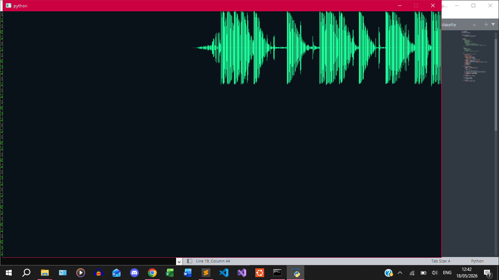
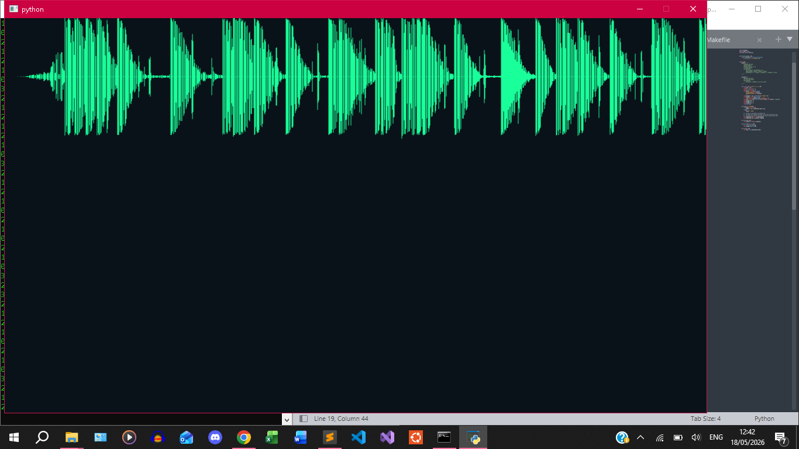
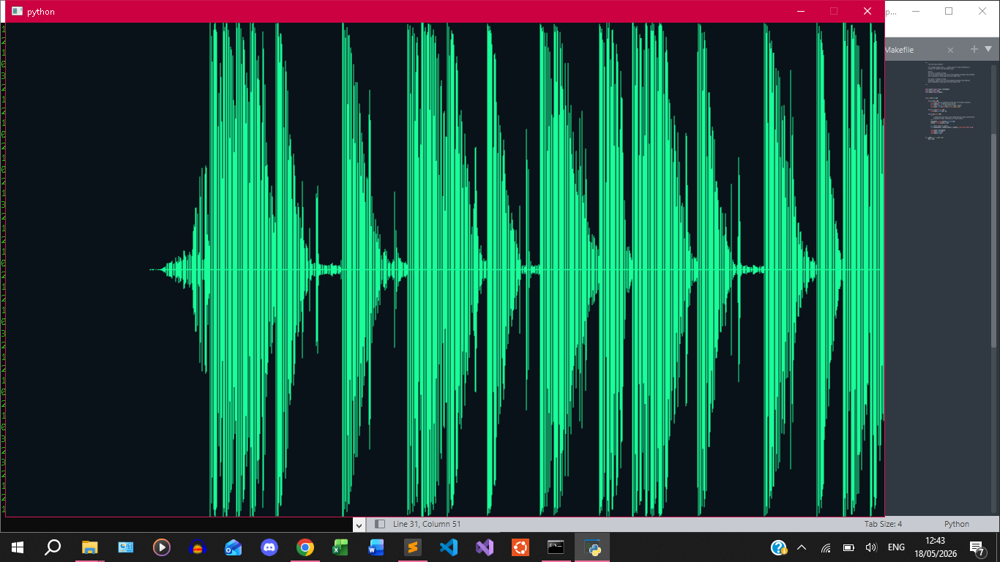
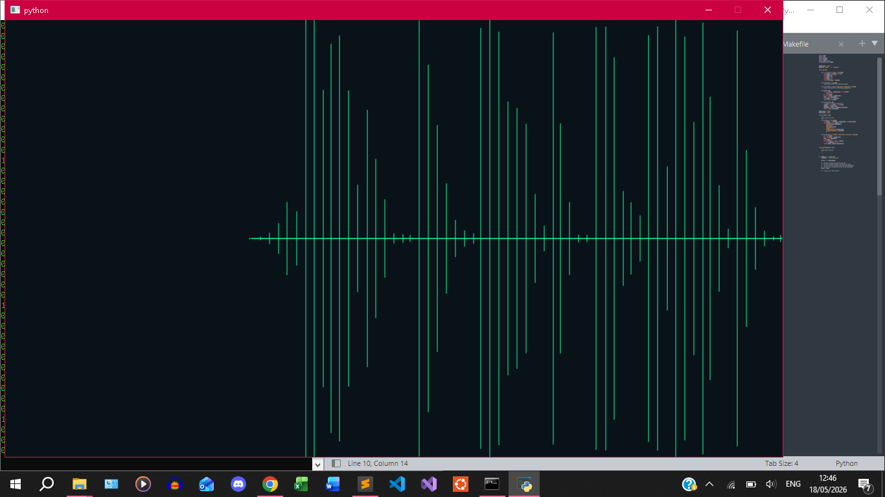
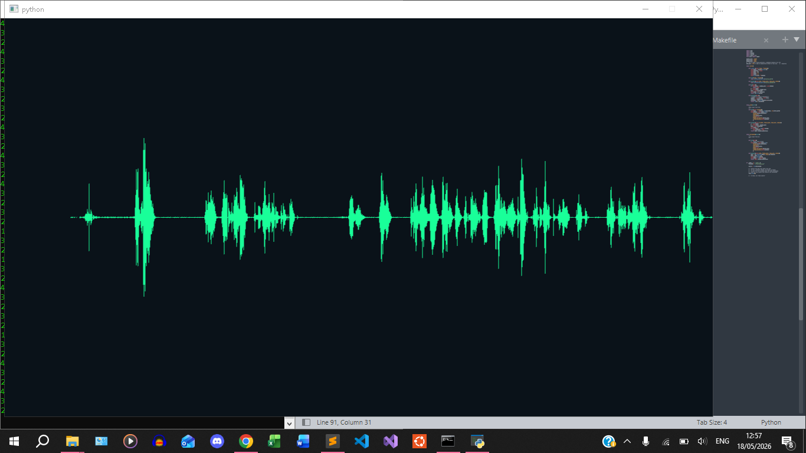
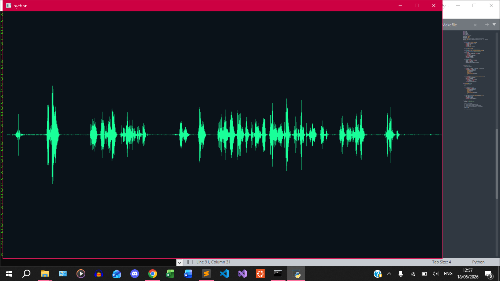
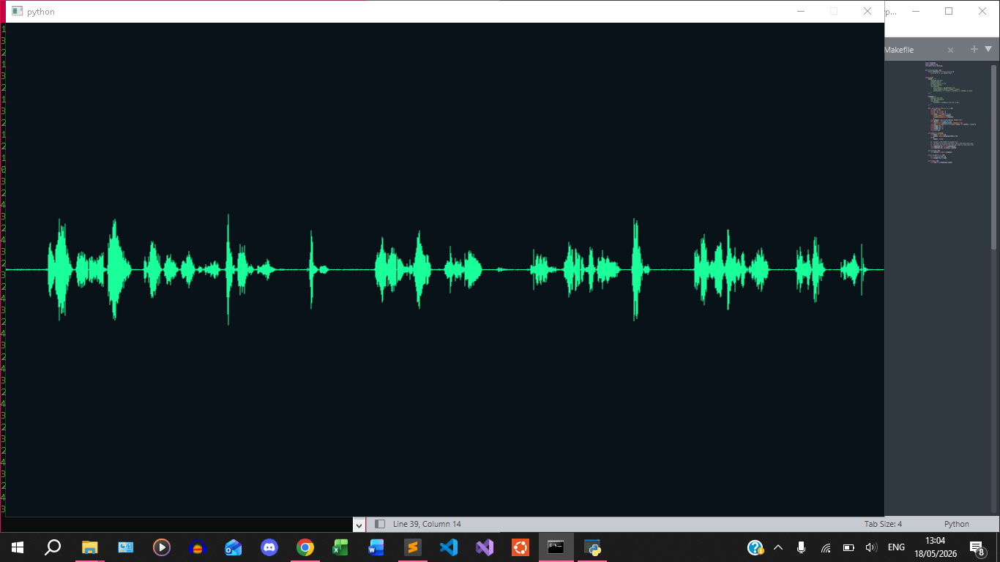
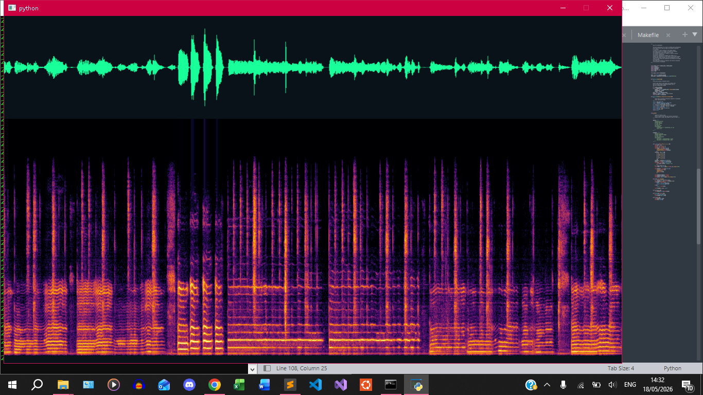
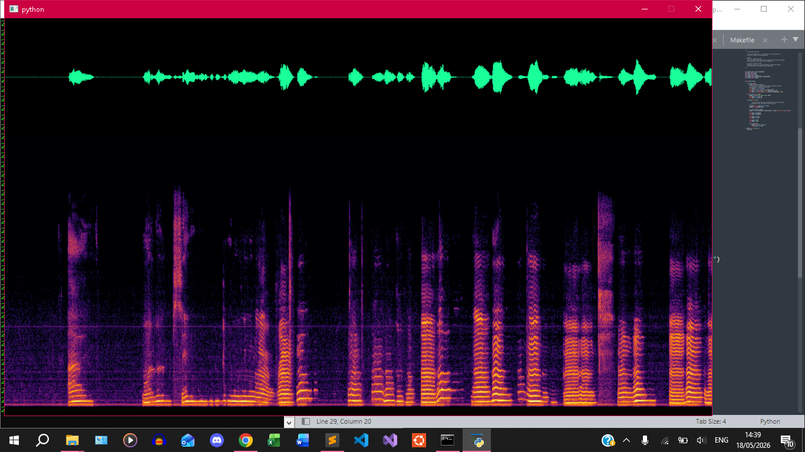
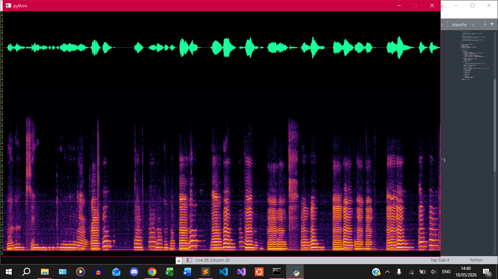
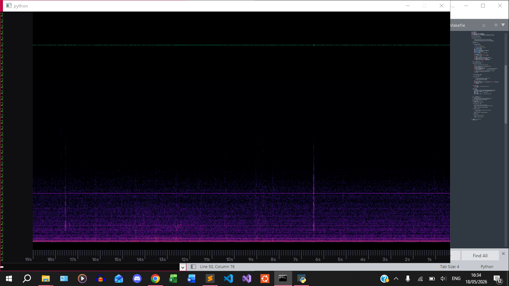
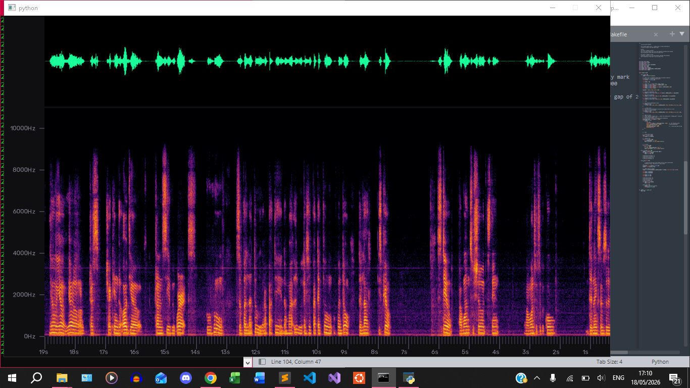
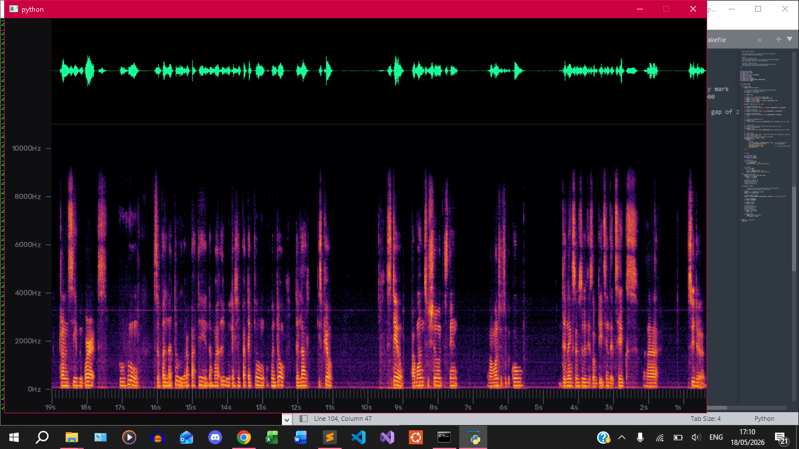
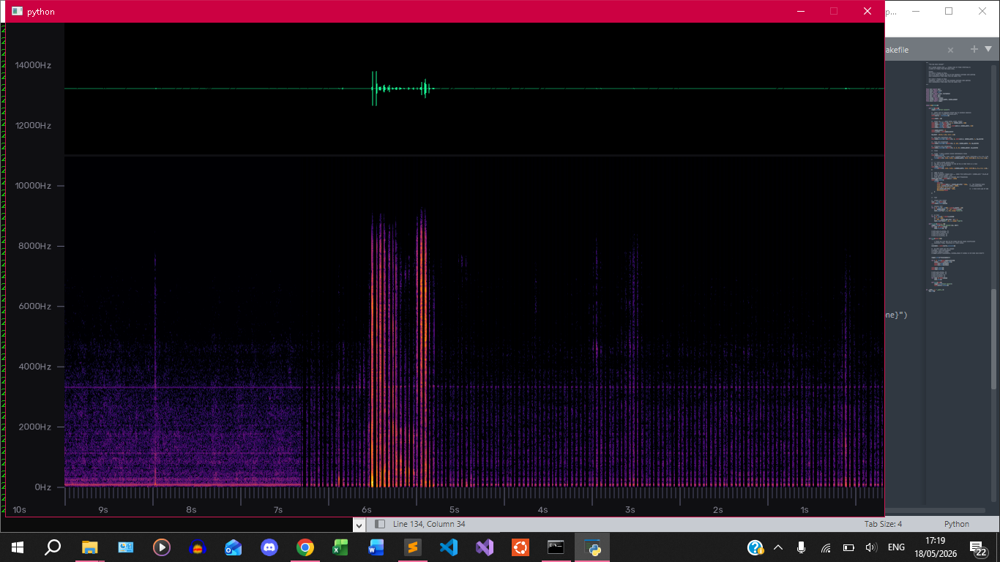
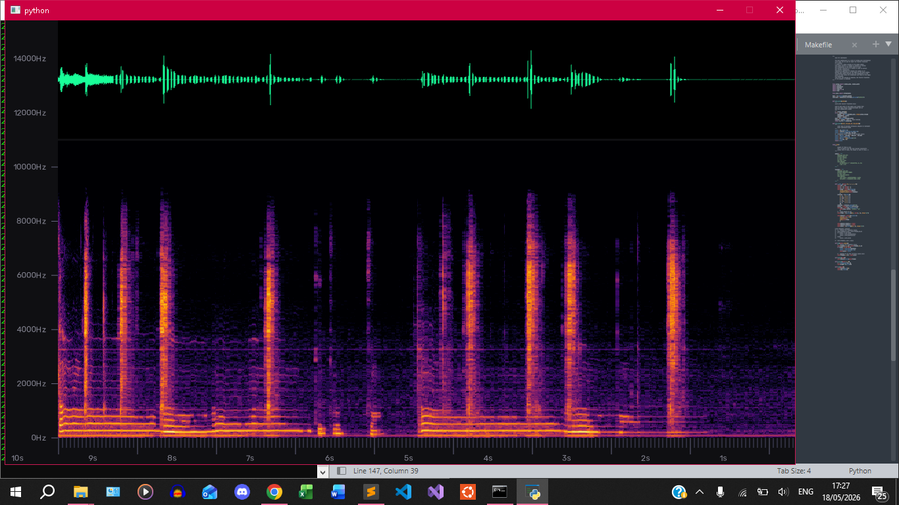
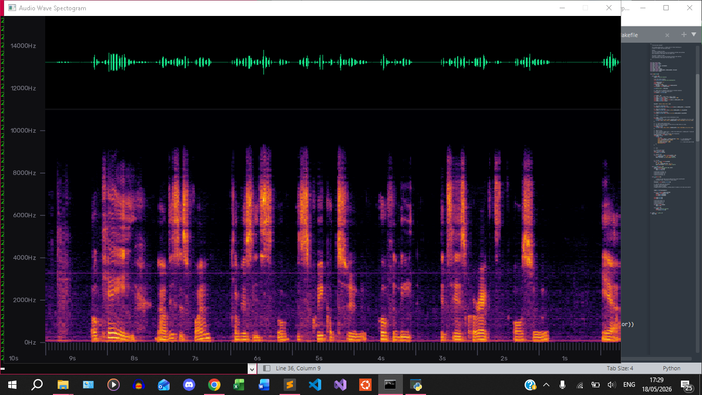
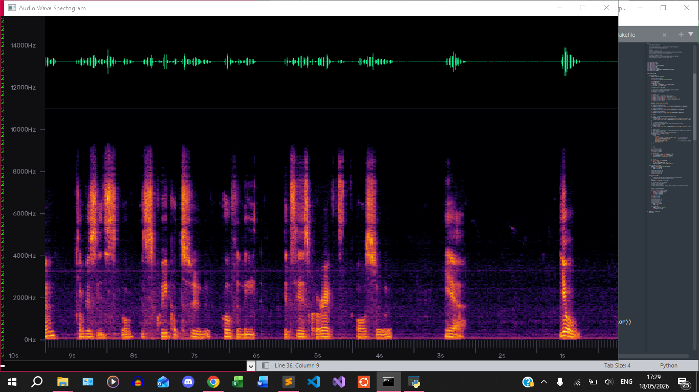
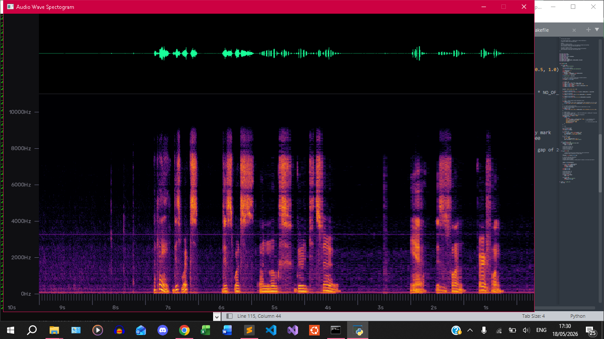
